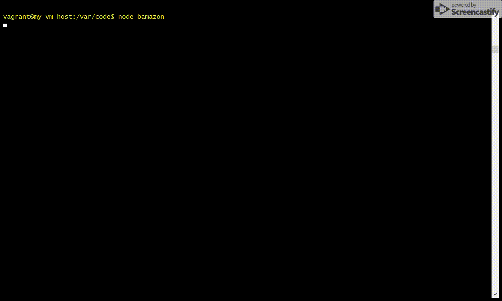

# Bamazon 

### A *"amazon"* like store-front

## Set up

- Clone repo.
- Open your favorite command prompt
- cd to the repo folder
    - *__Optional__* 
    - *Optional steps to run it on a VM*
    - *Once you are in the folder with the .vagrantfile run 'vagrant up'*
    - *after the box is set up run 'vagrant ssh'*
    - *cd /var/code*
- cd code
- run 'npm install'
- change the password in the connection.js to what you mysql password is
- connect to workbench or whatever mysql database you are using via SSH tunnel
- run bamazon.js

### What Each JavaScript File Does

1. `bamazon,js`

- A starting page will ask you if you are customer, manager or supervisor then send you to where you need to go

-----------------------

1. `bamazonCustomer.js`

- View all inventory
- Buy a product by Item Id 

-----------------------

1. `bamazonManager.js`

- View all inventory
- View inventory that is below 5 in stock

- Add to inventory stock
- Add new inventory product

-----------------------

1. `bamazonSupervisor.js`

- View all departments
- Add new departments

-----------------------

## Technology Used

* Node.js
* Javascript
* SQL/MySQL 
* [NPM chalk](https://www.npmjs.com/package/chalk)
* [NPM inquirer](https://www.npmjs.com/package/inquirer)
* [NPM cli-table-redemption](https://www.npmjs.com/package/cli-table-redemption)
* [NPM mysql](https://www.npmjs.com/package/mysql)
* [NPM dotenv](https://www.npmjs.com/package/dotenv)

## Author
### **Joshua LeBoeuf**